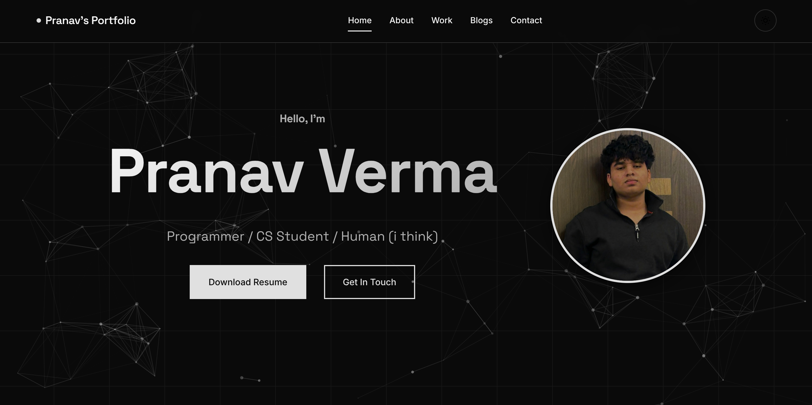
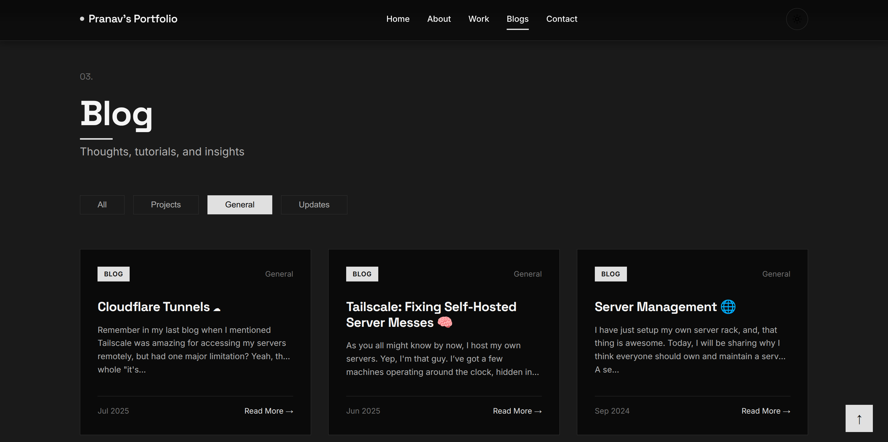

# 🌏 Portfolio 🌏




Main URL's: 
  -   https://pranavv.co.in/ <br>
  -   https://blogs.pranavv.co.in/ <br>
  
Backup URL's: 
  -   https://pranavverma-droid.github.io/Portfolio/main/
  -   https://pranavverma-droid.github.io/Portfolio/blogs/ <br><br>

This Code is [Licensed](LICENSE)!


### Tools Used:
    - HTML + CSS + JS
    - Vue.js
    - Prism.js
    - Particle.js 
    - Firebase
    - Animate.css
    - JQuery

## Docker Deploy 🐋
To run this code via **docker**, pull the repository via:

```bash
git clone https://github.com/PranavVerma-droid/Portfolio.git

cd Portfolio/docker
```


and then run this to deploy via docker:
```bash
docker compose up -d
```
After that, you can access the website via:
 ```
 http://127.0.0.1:5646
 http://127.0.0.1:5645
 ```

 ### Change Port
 You can change the [.env](docker/.env) file to change the web host port of the website.

 ### Update Portfolio
 Run these commands:
 ```bash
 cd Portfolio

 git pull

 cd docker
 
 docker compose pull && docker compose up -d
 ```

## Manual Deploy 💪
To deploy without Docker, first pull the repository via:
```bash
git clone https://github.com/PranavVerma-droid/Portfolio.git

cd Portfolio
```

After That, Run the following commands to deploy the website:

```bash
npm install
npm start
```

Now, you can access the website via:
 ```
 http://127.0.0.1:5646
 http://127.0.0.1:5645
 ```

# License

    Copyright (C) 2024  Pranav Verma

    This program is free software: you can redistribute it and/or modify
    it under the terms of the GNU Affero General Public License as
    published by the Free Software Foundation, either version 3 of the
    License, or (at your option) any later version.

    This program is distributed in the hope that it will be useful,
    but WITHOUT ANY WARRANTY; without even the implied warranty of
    MERCHANTABILITY or FITNESS FOR A PARTICULAR PURPOSE.  See the
    GNU Affero General Public License for more details.

    You should have received a copy of the GNU Affero General Public License
    along with this program.  If not, see <http://www.gnu.org/licenses/>.

    For more information, please see [LICENSE](LICENSE).


